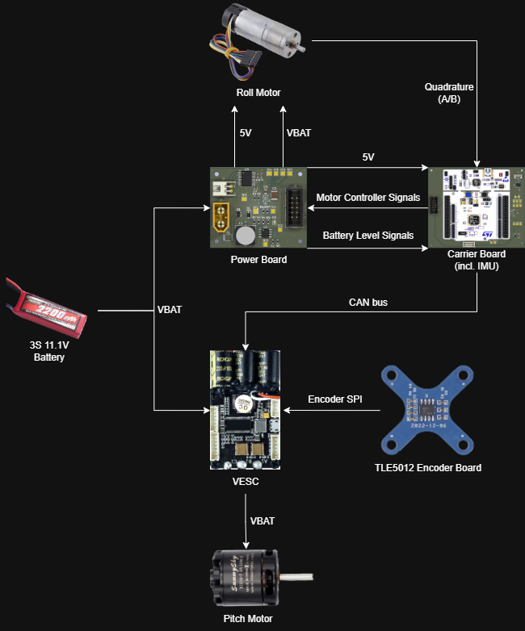
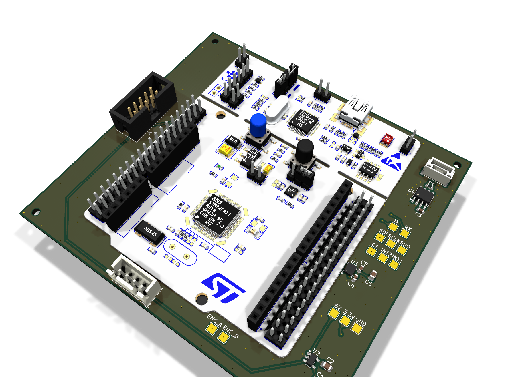
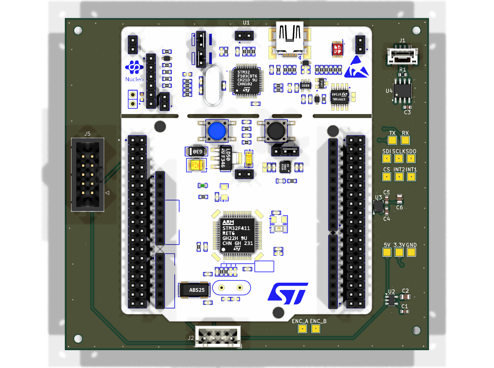
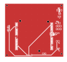
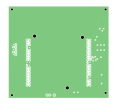
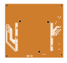
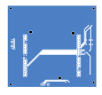
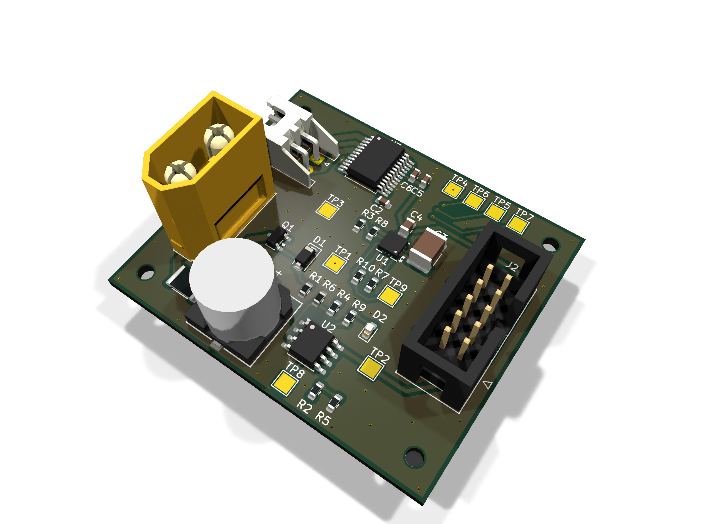
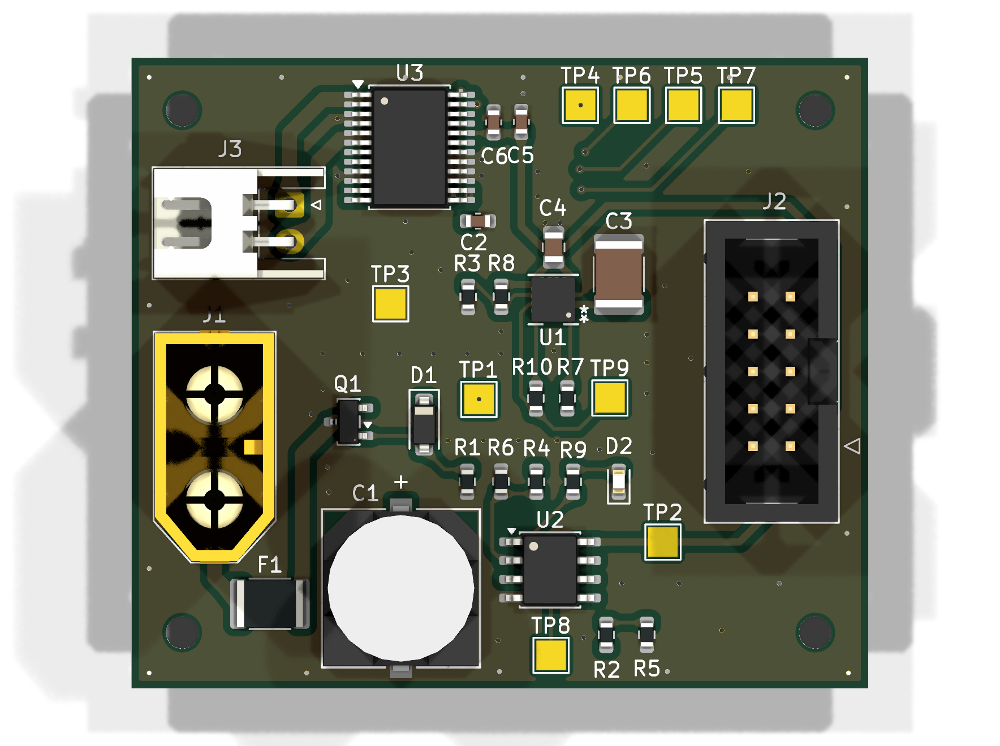
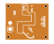

# Two-Axis Balancing Robot

A robot that balances in pitch and roll. The two axes use different hardware: pitch
runs a brushless motor through a VESC over CAN, roll runs a brushed motor through an
H-bridge on a custom power board. Both close around an STM32G474 and an ICM-42688-P
IMU on a custom carrier board. Two custom 4-layer boards, designed in KiCad.

<!-- TODO
     - mechanical: CAD screenshots once the design is finished
     - the Simulink model and the LQR weight-selection model, once cleaned up
     - fp-lib-table on both boards points at C:/Users/brmey/Downloads, so footprint
       libraries won't resolve on another machine
     - the carrier render uses a Nucleo-64 F401 STEP as a stand-in; same form factor
       as the G474RE but the silkscreen says F411 if you look closely
     images are generated, see docs/regenerate-images.md
-->

## Specifications

| Parameter | Value |
|---|---|
| Axes | Pitch and roll, separate drive hardware |
| Controller | STM32G474RET6 (Nucleo-G474RE on the carrier board) |
| IMU | ICM-42688-P over SPI, both interrupt lines broken out |
| Pitch drive | Brushless motor via VESC, commanded over CAN |
| Pitch feedback | TLE5012 magnetic encoder, SPI to the VESC |
| Roll drive | Brushed motor via TB6612FNG dual H-bridge |
| Roll feedback | Quadrature encoder into the carrier board |
| Battery | 3S LiPo, 11.1 V nominal |
| Carrier board | 101.6 × 92.9 mm, 4-layer |
| Power board | 50.0 × 42.9 mm, 4-layer |

## Status

Both custom PCBs are designed and the electrical architecture is laid out. Mechanical
design is partly finished.

I simulated the pitch axis in Simulink first. That's what pushed me to LQR: the axes
are cross-coupled, and tuning them as separate loops was difficult enough that full
state feedback made more sense than fighting the interaction by hand. What I'm working
on now is deriving the equations for motion for the entire system from the Lagrangian, linearizing about the upright equilibrium, and designing a discrete-time LQR to stabilize it, implementing Bryson's rule to set cost weights. This all is being done in ATLAB

## Repository layout

| Path | Contents |
|---|---|
| `hardware/two_axis_balancing_carrier/` | Carrier board KiCad project |
| `hardware/two_axis_balancing_power/` | Power board KiCad project |
| `docs/` | Architecture diagram, board renders, layer plots |

## Hardware

Both boards are 4-layer. Every copper layer below is plotted from the top and
unmirrored, so features line up between layers.

### Carrier board

101.6 × 92.9 mm. Holds the Nucleo-G474RE and everything the control loop reads.

| | |
|---|---|
|  |  |

The ICM-42688-P is on SPI (`CS`, `SCLK`, `SDI`, `SDO`) with `INT1` and `INT2` brought
out, so the loop can run off data-ready rather than polling. An SN65HVD230 with 120 Ω
termination puts the board on the CAN bus to the VESC. A MIC5219-3.3 makes the 3.3 V
rail from the 5 V coming off the power board.

Roll encoder channels come in here on `ENC_A` / `ENC_B`. Motor commands (`AIN1`,
`AIN2`, `PWMA`, `STBY`) and the battery signals go back to the power board over a 2×5
IDC ribbon. There are 13 test points, and the SPI, UART, encoder and rail pads are all
labelled on the silkscreen for bring-up.

| `F.Cu` | `In1.Cu` |
|---|---|
|  |  |

| `In2.Cu` | `B.Cu` |
|---|---|
|  |  |

### Power board

50.0 × 42.9 mm. Takes the battery in and handles everything that touches VBAT.

| | |
|---|---|
|  |  |

Battery comes in on an XT60, behind a 3 A fuse, an AO3401A P-channel MOSFET for
reverse polarity, and a 10 V zener. An RPL-1.0-R module makes the 5 V rail and reports
`Buck_PG` back to the MCU. A TB6612FNG dual H-bridge drives the roll motor on
`MOTOR_P` / `MOTOR_N`.

Battery monitoring is done on this board rather than in firmware. A divider gives
`BAT_LEV`, an LM393 compares it against `BAT_REF`, and `BAT_LOW` goes back to the
carrier board. The MCU sees both the raw level and a latched low flag.

| `F.Cu` | `In1.Cu` |
|---|---|
|  |  |

| `In2.Cu` | `B.Cu` |
|---|---|
|  |  |
